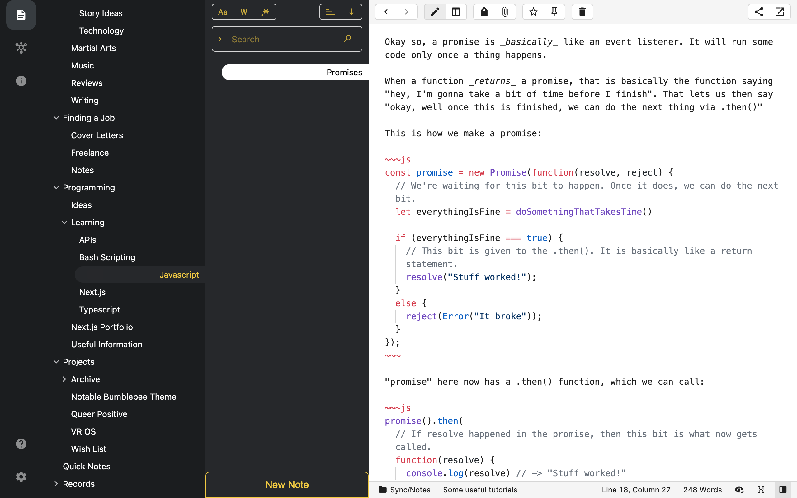

# New Note Button

This will add a 'new note' button to the middlebar in classic mode.

## Installation
To install this, copy-paste the contents of the .js file into this location `File -> Preferences -> Custom CSS/JS... -> Javascript`
